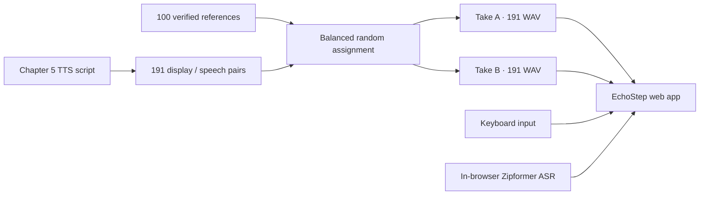

<div align="center">

# EchoStep · DictAI

### 듣고, 맞히고, 반복하는 브라우저 영어 딕테이션

**191개 문장 · 100개 화자 레퍼런스 · 382개 사전 생성 음성 · 브라우저 내 음성 인식**


</div>

---

## 무엇을 하는 프로젝트인가요?

EchoStep은 영어 문장을 듣고 단어를 하나씩 찾아가는 딕테이션 웹앱입니다.<br>
현재 빌드는 **A1 Concise Edition Chapter 5**의 제목 1개와 본문 190개, 총 191개 문제를 제공합니다.

한 문장에는 서로 다른 화자 두 명의 음성이 준비되어 있습니다. 재생할 때마다 두 음성이 번갈아 나오므로 한 사람의 발음에 익숙해지는 문제를 줄였습니다. 답은 키보드 또는 브라우저 안에서 실행되는 음성 인식으로 맞힐 수 있으며, 두 입력 경로는 서로의 내용을 수정하거나 지우지 않습니다.



## 핵심 기능

| 영역 | 동작 |
|---|---|
| 문제 | Chapter 5 총 191문장을 순서대로 학습 |
| 두 화자 재생 | 문장마다 서로 다른 두 레퍼런스를 사용하고 재생 시 교대 |
| 100명 음성 뱅크 | 미국 남성·미국 여성·영국 남성·영국 여성 각 25명 |
| 다양한 환경 | 스튜디오, 공개 연설, 스트리머, 전화, 화상회의, 팟캐스트, 카페, 거리 등 25종 |
| 키보드 입력 | Space 또는 Enter로 제출하며 음성 인식과 완전히 독립 |
| 음성 입력 | sherpa-onnx Zipformer가 브라우저에서 실시간 실행 |
| 모델 선택 | Full Zipformer와 20M 경량 Zipformer 중 선택 |
| 판정 설정 | Beam, Threshold, Candidate Margin을 화면에서 조절 |
| 힌트 | 단어 칸 개별 열기, 고유명사 보기, 전체 포기 |
| 학습 흐름 | Again / Next, 5단계 재생 속도, 현재 문장 위치 저장 |
| 오프라인 캐시 | ASR 모델을 IndexedDB에 저장해 반복 다운로드 방지 |
| 생성 현황 | `/build-status`에서 레퍼런스·오디오·큐 상태를 실시간 표시 |

## 100개 레퍼런스 설계

| 화자군 | 수량 | ID 범위 |
|---|---:|---:|
| US Male | 25 | `ref001`–`ref025` |
| US Female | 25 | `ref026`–`ref050` |
| UK Male | 25 | `ref051`–`ref075` |
| UK Female | 25 | `ref076`–`ref100` |

레퍼런스마다 원문, 화자 특성, 환경, 생성 시드, ASR 결과와 음향 측정값을 함께 보관합니다. 모든 레퍼런스는 대본 일치 검사를 통과해야 사용할 수 있습니다.

문장 배정은 재현 가능한 고정 시드를 사용합니다.

- 문장 하나에 같은 레퍼런스를 중복 배정하지 않습니다.
- 100명 전원이 Chapter 5 전체에서 사용됩니다.
- 각 레퍼런스의 총 사용 횟수는 3회 또는 4회입니다.
- 배정 결과는 `reference-assignments.json`에 기록됩니다.

## 음성 인식 방식

음성 인식은 서버 GPU가 아니라 사용자 브라우저의 WASM 런타임에서 동작합니다.

| 설정 | 의미 |
|---|---|
| **Model** | 정확도 중심 Full 모델 또는 다운로드가 작은 20M 모델 |
| **Beam** | modified beam search에서 유지할 탐색 경로 수 |
| **Threshold** | 인식된 단어가 정답 후보로 인정되기 위한 최소 점수 |
| **Candidate** | 1위 후보가 2위 후보보다 앞서야 하는 최소 점수 차이 |

정확히 일치하는 단어·축약형·분리 표현을 먼저 처리하고, 일치하지 않을 때만 철자와 발음 형태의 유사도를 이용합니다. 음성 결과는 키보드 입력창의 값을 읽거나 변경하지 않습니다.

## 화면 구성

### Dictation

- 빈 단어 칸을 누르면 해당 단어만 공개
- `Names`로 문장 안의 고유명사 공개
- `Give Up`으로 전체 정답 공개
- 정답 완료 후 `Again`과 `Next` 제공
- `0.5×`, `0.8×`, `1.0×`, `1.2×`, `1.5×` 재생

### Build Status

`https://<server>:8774/build-status`

- 화자군별 레퍼런스 완성 수
- Take A / Take B 생성 수
- Pending / Active / Completed / Failed 큐 수
- 3초 간격 자동 갱신

## 프로젝트 구조

```text
dictai/
├── index.html                         # 딕테이션 화면
├── app.js                             # 문제·재생·입력·음성 인식 동작
├── styles.css                         # 메인 UI
├── server.py                          # FastAPI 문제·오디오 API
├── persistent-model-loader.js         # ASR 모델 IndexedDB 캐시
├── wasm-asr-bootstrap.js              # Zipformer WASM 초기화
├── build-status.html                  # 생성 현황 화면
├── build-status.js
├── build-status.css
├── data/
│   ├── ch005.json                     # 표시문과 TTS용 발음문
│   └── ch005-proper-nouns.json        # 문장별 고유명사
└── tools/
    ├── build_reference_bank.py        # 4×25 레퍼런스 생성·검사
    ├── build_and_enqueue.py           # 균형 배정 및 382개 SoulX 작업 생성
    ├── build_wasm_model_package.py    # 두 번째 WASM 모델 패키징
    └── verify_environment.py          # 배포 전 전수검사
```

## 서버 실행

런타임 음성과 모델 파일은 크기가 커서 Git에 포함하지 않습니다. 기본 서버 배치는 다음과 같습니다.

```text
/home/scpark/dictai/                              # 앱 소스
/home/scpark/harry-concise-ch5/audio-a/          # Take A · 191개
/home/scpark/harry-concise-ch5/audio-b/          # Take B · 191개
/home/scpark/harry-concise-ch5/reference-bank/   # 검증된 레퍼런스 100개
/home/scpark/harry-concise-ch5/manifest/         # 문장·화자 배정표
/home/scpark/dictai/asr-wasm/                    # 브라우저 ASR 모델
/home/scpark/dictai/certs/                       # HTTPS 인증서
```

```bash
python tools/verify_environment.py
./start-https.sh
```

기본 주소는 `https://<server>:8774/`입니다. 마이크 사용을 위해 HTTPS가 필요합니다.

## 환경 변수

| 변수 | 용도 |
|---|---|
| `DICTAI_AUDIO_A` | 첫 번째 음성 폴더 |
| `DICTAI_AUDIO_B` | 두 번째 음성 폴더 |
| `DICTAI_MANIFEST` | Chapter 5 manifest |
| `DICTAI_PROPER_NOUNS` | 고유명사 metadata |
| `DICTAI_PROGRESS_DB` | 문장 위치 DB |
| `DICTAI_BUILD_ROOT` | 레퍼런스·생성 큐 상태 루트 |
| `DICTAI_PYTHON_ENV` | Python 환경 |
| `DICTAI_HOST`, `DICTAI_PORT` | HTTPS bind 주소와 포트 |
| `DICTAI_SSL_KEY`, `DICTAI_SSL_CERT` | TLS 키와 인증서 |

## 현재 검증 상태

```text
Reference bank       100 / 100
Chapter 5 sentences  191 / 191
Take A audio          191 / 191
Take B audio          191 / 191
Generated WAV checks  382 / 382
Queue failures          0
```

> Chapter 3과 Chapter 4의 데이터는 이 저장소에서 다시 생성하지 않습니다. 이 브랜치는 복구된 프로그램 환경과 Concise Edition Chapter 5에 집중합니다.
