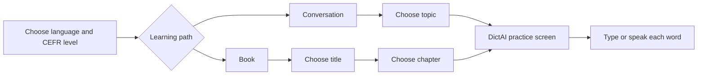

<div align="center">

# DictAI

### One workspace for conversation practice and book-based dictation

**A1–C2 courses · English and Korean · browser speech recognition · multi-chapter books**


</div>

---

## Product overview

DictAI is a listening and dictation workspace with a course menu on the left and the active exercise on the right. The main product combines two learning paths:

- **Conversation** — short two-speaker exercises organized by CEFR level and topic.
- **Book** — long-form dictation organized by title and chapter, with direct sentence navigation.

Both paths use the same current DictAI practice interface, keyboard matching, speech recognition controls, hints, playback speeds, and completion flow.



## Main interface

| Area | Behavior |
|---|---|
| Language | Switch between English and Korean conversation courses |
| Level | A1, A2, B1, B2, C1, and C2 themes |
| Conversation | Always-visible compact topic list with five curated topics plus Random |
| Book | Compact title list; supported titles expand into a chapter submenu |
| Practice | Current DictAI word-slot interface shared by Conversation and Book |
| Input isolation | Voice recognition and typed input remain independent |
| Progress | Each conversation topic and each book chapter retain separate positions |

## Conversation curriculum

The expanded curriculum is derived from 2,312 expression-led dialogues in *Mentors Smart English Expressions, Chapters 01–09*. The source was parsed by chapter, unit, expression, timestamp, and A/B turn. A corpus-relative CEFR pass then ranks dialogue length, clause load, lexical form, turn count, and expression complexity.

The old narrow topic menu was replaced after checking the source distribution. Every level now has five broad curriculum lanes plus Random, so material is grouped by what the dialogue is actually doing instead of being forced into the previous categories.

| Level | Topics |
|---|---|
| A1 | Work, School & Shopping · Travel & Communication · People & Simple Plans · Daily Life & Health · Thoughts, Feelings & Choices |
| A2 | Work, Study & Money · Travel, Tech & Calls · Plans & Relationships · Home, Food & Wellbeing · Ideas, Feelings & Problems |
| B1 | Work & Responsibilities · Communication & Travel · Relationships & Social Life · Health & Lifestyle · Opinions & Problem Solving |
| B2 | Career & Finance · Digital & Public Life · Relationships & Conflict · Wellbeing & Change · Decisions & Influence |
| C1 | Professional & Academic Life · Public Communication & Mobility · Interpersonal Nuance · Lifestyle, Risk & Recovery · Reasoning, Strategy & Consequences |
| C2 | Institutional & Economic Affairs · Systems & Public Communication · Complex Social Dynamics · Human Condition & Wellbeing · Abstract Reasoning & Discourse |

| Level | Dialogues |
|---|---:|
| A1 | 416 |
| A2 | 463 |
| B1 | 508 |
| B2 | 439 |
| C1 | 301 |
| C2 | 185 |

Conversation exercises preserve every source turn, including three-, four-, and five-turn exchanges. A selected category uses its full dialogue set rather than a five-item sample. Sentence-number navigation remains hidden in Conversation mode.

### Dialogue audio policy

- One of 25 recording environments is chosen for the complete dialogue.
- Speaker A and Speaker B are sampled independently from the four matching references in that environment: US male, US female, UK male, and UK female.
- The two references must be distinct.
- The recording environment is locked for every turn; it cannot change inside a dialogue.
- Generation is resumable and split across GPU shards. Each completed dialogue produces one WAV plus turn-boundary metadata.

## Book curriculum

### Harry Potter 5

The A1 Book list includes **Harry Potter 5** as an expandable title.

| Chapter | Title | Sentences | Audio takes |
|---:|---|---:|---:|
| 3 | The Advanced Guard | 641 | 2 per sentence |
| 4 | Number Twelve, Grimmauld Place | 600 | 2 per sentence |
| 5 | The Order of the Phoenix | 191 | 2 per sentence |

Book mode exposes the complete sentence navigator:

- previous and next buttons;
- direct sentence-number entry;
- current sentence and chapter total;
- chapter progress bar;
- an independent saved position for every chapter.

## Dictation and answer matching

| Feature | Description |
|---|---|
| Word slots | Reveal and solve a sentence one word at a time |
| Typed answers | Submit words with Space or Enter |
| Voice answers | Match live browser recognition results against unsolved words |
| Contractions | Match contracted and expanded forms without changing display text |
| Names | Reveal proper nouns separately |
| Give Up | Reveal the full answer and keep the result distinct from a solved answer |
| Duplicate answers | Already-entered words are reported without clearing typed input |
| Completion | Again repeats the current sentence; Next advances according to the active mode |
| Playback | 0.5×, 0.8×, 1.0×, 1.2×, and 1.5× speeds |

## Voice recognition

Speech recognition runs locally in the browser through sherpa-onnx WASM. The server does not need a GPU for recognition.

### Selectable models

| UI label | Model |
|---|---|
| Full | `sherpa-onnx-streaming-zipformer-en-2023-06-21` |
| 20M | `sherpa-onnx-streaming-zipformer-en-20M-2023-02-17` |

The downloaded model is stored persistently in IndexedDB and reused on later visits.

### Adjustable recognition controls

| Control | Purpose |
|---|---|
| Beam | Number of search paths retained by modified beam search |
| Threshold | Minimum confidence required to accept a candidate |
| Candidate | Minimum advantage the best candidate needs over the runner-up |

Pressing **Apply** preserves the previous Voice ON/OFF state. A model or Beam change restarts the recognizer and restores that state after reload. A normal fresh visit still defaults to Voice OFF.

### Input safety

Voice recognition has its own result path. It never reads, modifies, submits, or clears the keyboard input field. Microphone level feedback is displayed independently from recognized text.

## Runtime architecture

```text
Browser
├── Main catalog UI
│   ├── Language and CEFR selection
│   ├── Conversation topics
│   └── Book and chapter selection
├── DictAI practice UI
│   ├── Typed input
│   ├── Voice input
│   ├── Word matching
│   └── Playback and navigation
└── sherpa-onnx WASM
    ├── Full Zipformer
    └── 20M Zipformer

FastAPI server
├── Course and book selection
├── Separate progress namespaces
├── Problem lifecycle and validation
├── Audio delivery
└── Static UI and model assets
```

## Repository layout

```text
dictai/
├── index.html                 # Main Conversation / Book workspace
├── app.js                     # Catalog, course, book, and chapter behavior
├── styles.css                 # Level themes and integrated layout
├── server.py                  # FastAPI course, chapter, problem, and audio API
├── practice-ui/               # Pinned current DictAI practice interface
├── data/                      # Proper-noun and local metadata
│   ├── mentors-conversations.json # Classified source, turns, and audio plan
│   └── mentors-catalog.json   # Runtime course catalog
├── tools/
│   ├── import_mentors_conversations.py
│   ├── classify_mentors_conversations.py
│   ├── build_mentors_catalog.py
│   └── generate_mentors_audio.py
├── build-status.html          # Runtime build status screen
├── build-status.js
├── build-status.css
├── start-https.sh             # HTTPS service on port 8771
└── start.sh                   # HTTP-to-HTTPS entry point
```

Large generated assets are intentionally not committed:

- Chapter audio files;
- conversation audio and catalogs;
- sherpa-onnx model packages;
- certificates;
- generated reference banks.

## Current server deployment

| Service | Address |
|---|---|
| Main DictAI product | `https://192.168.0.68:8771/` |
| Chapter 5 build/runtime reference | `https://192.168.0.68:8774/` |

HTTPS is required for browser microphone permission. A locally issued certificate may require one-time approval in the browser.

## Verified behavior

```text
Conversation course selection        PASS
Conversation problem generation      PASS
Conversation / typed-input isolation PASS
Harry Potter Chapter 3               641 / 641
Harry Potter Chapter 4               600 / 600
Harry Potter Chapter 5               191 / 191
Book direct sentence navigation      PASS
Book previous / next navigation      PASS
Chapter-specific saved positions     PASS
Audio delivery                       PASS
Full and 20M ASR assets              PASS
Voice state after Apply              PASS
```

## Branch policy

`main` is the integrated DictAI product described above. The earlier Chapter 5-only reconstruction remains available in `chapter5-concise-rebuild` for reference.
