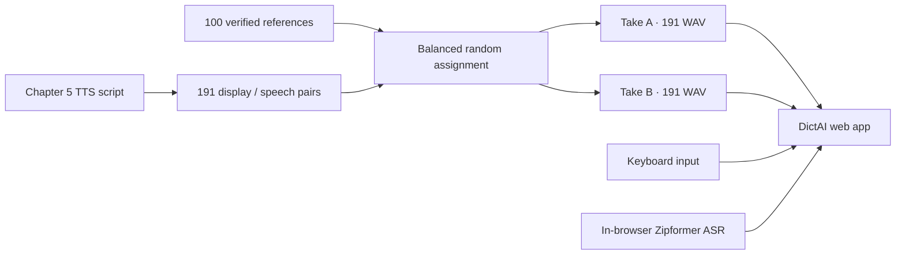

<div align="center">

# DictAI

### Listen, solve, and repeat — English dictation in the browser

**191 sentences · 100 voice references · 382 pre-generated recordings · in-browser speech recognition**


</div>

---

## What is DictAI?

DictAI is an English dictation web app where learners listen to a sentence and uncover it one word at a time. This build contains **191 A1 Concise Edition Chapter 5 exercises**: one chapter title and 190 body sentences.

Every sentence has two recordings made with two different voice references. Repeated playback alternates between them, helping learners avoid becoming accustomed to a single speaker. Answers can be entered by keyboard or recognized locally in the browser. The two input paths are isolated: speech recognition never edits or clears typed text.



## Features

| Area | Behavior |
|---|---|
| Exercises | 191 sequential Chapter 5 dictation problems |
| Two-voice playback | Two distinct references per sentence, alternating on replay |
| 100-voice bank | 25 US male, US female, UK male, and UK female references |
| Recording situations | 25 settings including studio, public speech, streaming, telephone, video call, podcast, café, and street |
| Typed input | Submit with Space or Enter, independently from voice recognition |
| Voice input | Real-time sherpa-onnx Zipformer recognition inside the browser |
| Model selection | Full Zipformer or the smaller 20M Zipformer |
| Recognition tuning | Adjustable Beam, Threshold, and Candidate Margin |
| Hints | Reveal one slot, reveal names, or give up and show the answer |
| Learning flow | Again / Next controls, five playback speeds, and saved sentence position |
| Persistent model cache | IndexedDB storage prevents repeated ASR model downloads |
| Build monitoring | `/build-status` reports reference, audio, and queue progress live |

## The 100-voice reference bank

| Speaker group | Count | ID range |
|---|---:|---:|
| US Male | 25 | `ref001`–`ref025` |
| US Female | 25 | `ref026`–`ref050` |
| UK Male | 25 | `ref051`–`ref075` |
| UK Female | 25 | `ref076`–`ref100` |

Each reference stores its transcript, speaker characteristics, recording situation, generation seed, ASR result, and acoustic measurements. A reference is eligible for synthesis only after its spoken content passes transcript verification.

Sentence assignment uses a reproducible fixed seed:

- The same reference can never occupy both takes of one sentence.
- All 100 references appear in Chapter 5.
- Each reference is used exactly three or four times.
- The complete mapping is recorded in `reference-assignments.json`.

## Speech recognition

Recognition runs in the user's browser through WASM, not on the server GPU.

| Setting | Meaning |
|---|---|
| **Model** | Accuracy-oriented Full model or download-friendly 20M model |
| **Beam** | Number of search paths retained by modified beam search |
| **Threshold** | Minimum score required to accept a recognized answer candidate |
| **Candidate** | Minimum lead the best candidate must have over the runner-up |

Exact words, contractions, and split expressions are checked first. When there is no exact match, DictAI compares spelling and phonetic shape. Voice results never read, change, or erase the keyboard input field.

## User interface

### Dictation

- Tap an empty word slot to reveal only that word.
- Use `Names` to reveal proper nouns in the current sentence.
- Use `Give Up` to reveal the complete answer.
- Choose `Again` or `Next` after completing an exercise.
- Replay at `0.5×`, `0.8×`, `1.0×`, `1.2×`, or `1.5×`.

### Build Status

Open `https://<server>:8774/build-status` to see:

- completed references by speaker group;
- Take A and Take B generation counts;
- pending, active, completed, and failed queue items;
- automatic updates every three seconds.

## Project structure

```text
dictai/
├── index.html                         # Dictation interface
├── app.js                             # Exercises, playback, input, and ASR behavior
├── styles.css                         # Main interface styling
├── server.py                          # FastAPI exercise and audio API
├── persistent-model-loader.js         # Persistent IndexedDB ASR cache
├── wasm-asr-bootstrap.js              # Zipformer WASM initialization
├── build-status.html                  # Live generation dashboard
├── build-status.js
├── build-status.css
├── data/
│   ├── ch005.json                     # Separate display and spoken text
│   └── ch005-proper-nouns.json        # Proper nouns by sentence
└── tools/
    ├── build_reference_bank.py        # Generate and verify the 4 × 25 voice bank
    ├── build_and_enqueue.py           # Balanced assignment and 382 SoulX jobs
    ├── build_wasm_model_package.py    # Package the second WASM ASR model
    └── verify_environment.py          # Full pre-deployment validation
```

## Running the server

Generated audio and browser ASR models are too large for Git and remain runtime assets. The default server layout is:

```text
/home/scpark/dictai/                              # Application source
/home/scpark/harry-concise-ch5/audio-a/          # Take A · 191 files
/home/scpark/harry-concise-ch5/audio-b/          # Take B · 191 files
/home/scpark/harry-concise-ch5/reference-bank/   # 100 verified references
/home/scpark/harry-concise-ch5/manifest/         # Sentence and voice assignments
/home/scpark/dictai/asr-wasm/                    # Browser ASR models
/home/scpark/dictai/certs/                       # HTTPS certificate and key
```

Validate the runtime before starting the service:

```bash
python tools/verify_environment.py
./start-https.sh
```

The default address is `https://<server>:8774/`. HTTPS is required for microphone access.

## Environment variables

| Variable | Purpose |
|---|---|
| `DICTAI_AUDIO_A` | First recording directory |
| `DICTAI_AUDIO_B` | Second recording directory |
| `DICTAI_MANIFEST` | Chapter 5 manifest |
| `DICTAI_PROPER_NOUNS` | Proper-noun metadata |
| `DICTAI_PROGRESS_DB` | Saved sentence-position database |
| `DICTAI_BUILD_ROOT` | Reference bank and generation queue root |
| `DICTAI_PYTHON_ENV` | Python environment |
| `DICTAI_HOST`, `DICTAI_PORT` | HTTPS bind address and port |
| `DICTAI_SSL_KEY`, `DICTAI_SSL_CERT` | TLS key and certificate |

## Verified build

```text
Reference bank       100 / 100
Chapter 5 sentences  191 / 191
Take A audio          191 / 191
Take B audio          191 / 191
Generated WAV checks  382 / 382
Queue failures          0
```

> Chapter 3 and Chapter 4 data are not regenerated in this repository. This branch focuses on the restored application environment and Concise Edition Chapter 5.
